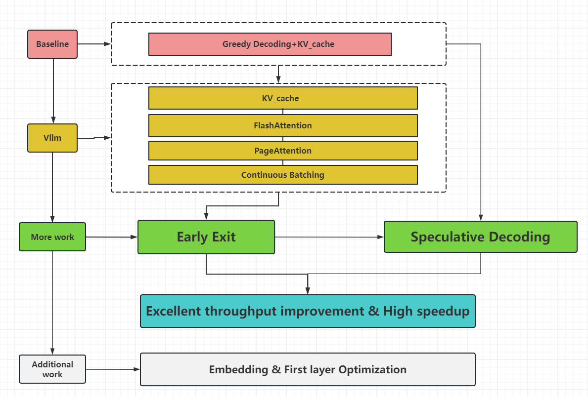

# The inference code for the ASC24 competition
本人于2023年12月份参加了世界超级计算机计算大赛(ASC24),该比赛中涉及大模型Llama2的推理优化问题，特此记录我们的优化成果

## File description

log: Log folder

vllm：The improved reasoning framework of vllm folder

baseline.py: Baseline test file

vllm.py: Vllm test file

early_exit60_10.py: Modifications to the llama model in the early_exit60 and early_exit10 cases

speculative.py: baseline+speculative test file

test_llamaLayer.py：Modifications to the llama model when testing the inference time of each layer

scrambled_sampled_dataset.json: Dataset

**reproduce:**

1. pip intsall -r requirments
2. cd vllm & python setup.py build & python setup.py install
3. Execute the corresponding test file according to the instructions (执行early_exit60.py和early_exit10.py这两个任务时，将这两个py更名为llama.py后更换到路径vllm/vllm/model_executor/models/llama.py下,然后运行vllm.py)

## Experiments Results

All experiments were conducted based on llama2-70b-hf (HuggingFace version). The test results for sections **Method** are shown in table below. In the table, "baseline" refers to the official baseline code provided, "vllm_nocache" represents vllm code without kv-cache, "vllm_cache" includes kv-cache, "vllm_early_exit60" denotes vllm code with early exit at layer 60, and "vllm_early_exit10" represents vllm code with early exit at layer 10.

Performance tests are based on the formulas used in the baseline, where:
- "Throughout" represents throughput, the number of requests processed per unit of time (one request represents a single input prompt from the dataset).
- "Tokens/s" indicates the average number of tokens processed per second during inference.
- "Prompt_num_tokens" is the total number of input tokens, and "Total_num_tokens" is the total number of input and output tokens.
- "Time" represents the entire inference time (including loading the model).
- "Speedup" represents the speedup ratio of each test scheme to baseline.

| Model             | Throughout(requests/s) | Tokens/s(tokens/s) | Prompt_num_tokens(tokens) | Total_num_tokens(tokens) | time     | Speedup |
| ----------------- | ---------------------- | ------------------ | ------------------------- | ------------------------ | -------- | ------- |
| baseline          | 0.03                   | 14.47              | 2518687                   | 4692726                  | 90:08:08 | 1.00    |
| vllm_nocache      | 0.53                   | 256.68             | 2518687                   | 4831411                  | 5:13:34  | 17.25   |
| vllm_cache        | 0.58                   | 279.58             | 2518687                   | 4831411                  | 4:47:53  | 18.79   |
| vllm_early_exit60 | 0.88                   | 426.98             | 2518687                   | 4831411                  | 3:08:26  | 28.70   |
| vllm_early_exit10 | 2.41                   | 1163.92            | 2518687                   | 4831411                  | 1:09:02  | 78.34   |

In addition, we also test the performance of the first 100 entries of the dataset on baseline and on baseline+speculative method, where llama2-70b is used as the base Model and llama2-7b is used as the draft Model. The results are shown in table below.

| Model                | Throughout(requests/s) | Tokens/s(tokens/s) | Prompt_num_tokens(tokens) | Total_num_tokens(tokens) | time     | Speedup |
| -------------------- | ---------------------- | ------------------ | ------------------------- | ------------------------ | -------- | ------- |
| baseline             | 0.02                   | 10.17              | 29564.00                  | 52851.00                 | 1:26:34  | 1       |
| baseline+speculative | 0.06                   | 30.37              | 29564.00                  | 52840.00                 | 00:29:00 | 2.99    |

## Method

​    Figure 1 illustrates our optimization approach, which is based on a baseline. We first select a suitable framework and apply some straightforward optimization algorithms, such as KV-Cache, FlashAttention, PageAttention, and Continuous Batching. Building upon this foundation, we incorporate more sophisticated algorithms like Early Exit and Speculative to ultimately achieve excellent throughput improvement and high speedup. In addition, we conduct an analysis of the time consumption throughout the entire inference process. This analysis involves identifying performance bottlenecks and thoroughly analyzing the underlying reasons. It provides us with insights and directions for further optimizing the inference process.

### Baseline

The baseline code provided by the organizers, `baseline.py`, is based on the `transformers` library and loads models in the Hugging Face format. It uses greedy decoding and leverages a key-value cache with `use_cache=True`.

Under this baseline, our subsequent optimizations are based on full precision and greedy decoding.

**Model Parallelism Challenge:** For the `LLAMA2-70B` model, we are faced with the challenge of model parallelism. Loading the weights of `LLAMA2-70B` requires approximately 140GB of VRAM, making it impossible to load a complete model on a single card. We need to employ model parallelism, such as `tensor_parallel`. In the `transformers` library, this can be simply achieved by setting `device_map="auto"` to maximize VRAM utilization.

**Framework Selection Post-Model Slicing:** After successfully slicing and loading the model, we tested the first ten data entries from the dataset provided by the organizers using several prominent and user-friendly frameworks like `gpt_fast`, `vllm`, and `llama.cpp`. The results, as shown in Table \ref{tab:ModelComparison}, indicate that `vllm` outperforms the other frameworks in terms of throughput and speed. Hence, we will use the `vllm` framework for further optimization.

The results are tabulated as follows in LaTeX format:

| Model     | Throughout(requests/s) | Tokens/s(tokens/s) | Prompt_num_tokens(tokens) | Total_num_tokens(tokens) |
| --------- | ---------------------- | ------------------ | ------------------------- | ------------------------ |
| vllm      | 0.24                   | 113.75             | 1910                      | 4718                     |
| llama.cpp | 0.16                   | 16.07              | 1910                      | 4718                     |
| gpt-fast  | 0.13                   | 25.93              | 1910                      | 4718                     |
|           |                        |                    |                           |                          |

### Vllm

vLLM, the latest work in Large Language Model (LLM) inference from LMSYS at UC Berkeley, focuses on Page Attention and Continuous Batching. Its optimization strategies include:

1. **KV-Cache:**
   Transformers inherently feature autoregressive inference, predicting one token at a time. In this process, the output token from the current round is concatenated with the historical input tokens to form the input for the next round. This iterative process involves redundant computations as consecutive rounds of input differ by only one token. KV Cache technology addresses this by saving reusable key-value vector results, effectively avoiding redundant calculations. Its implementation is straightforward and already included in the baseline. Comparative experiments have been conducted in this regard.
- **FlashAttention:**
  Traditional attention mechanisms require multiplying Query, Key, and Value matrices to generate an attention matrix. This is followed by applying the Softmax operation to the attention matrix to get the weighted matrix, which is then multiplied with the Value matrix for the output. FlashAttention integrates the entire attention calculation into a single large operator, completing the Softmax computation in one pass and avoiding storing intermediate matrices S and P. This localizes the global softmax calculation method, reducing storage access overhead, and significantly enhancing computational efficiency. vLLM uses *xformers' memory_efficient_attention_forward* in its attention mechanism, thereby indirectly utilizing FlashAttention.

- **PagedAttention:**
  Research found that previous systems, due to lack of fine-grained memory management, wasted 60% to 80% of VRAM, mainly due to KV Cache. Effectively managing KV Cache thus becomes a significant challenge. Unlike traditional attention mechanisms, PagedAttention manages keys and values more flexibly, akin to how virtual memory is managed in operating systems. Blocks can be viewed as pages, tokens as bytes, and sequences as processes. Continuous logical blocks of a sequence are mapped to discontinuous physical blocks through block tables. As new tokens are generated, physical blocks are allocated as needed. This innovative approach effectively improves VRAM utilization, minimizing VRAM wastage, and significantly enhancing inference service throughput. In vllm, this is implemented as the operator *single_query_cached_kv_attention*. In fact, vllm's initial text input uses FlashAttention, followed by PagedAttention for autoregressive token generation.

- **Continuous Batching:**
  In our scenario, the input and output of large models are variable, with significant differences in the length of input and output tokens for each data entry. Traditional methods in batch sequence inference can cause 'bubbling', leading to GPU resource wastage. Continuous Batching is a strategy that refines traditional batch task scheduling to the step level. Its core idea is to maintain Running and Waiting queues for flexible transition of sequence states. After generating each token in autoregression, the scheduler checks the sequence state; completed sequences are removed from the Running queue, and a sequence is selected from the Waiting queue based on FCFS strategy and added to the Running queue for efficient continuous task processing. This method emphasizes task-level fine-grained scheduling to maximize the use of computational resources and reduce waiting time. It is well-suited for tasks involving continuous sequence generation.

These strategies primarily aim to increase GPU utilization and reduce IO overhead, enhancing large model inference efficiency.

Tests on 8 A100-40G-PCIE machines included NoKVCache+NoFlashAttention, NoKVCache, and All (native vLLM). Challenges encountered, such as decoding strategy differences from HuggingFace transformers, are detailed in the supplement.

### Early Exit

The primary distinction between models in the LLAMA2 series lies in the number of Decoder Blocks they possess; LLAMA2-7b features 32 blocks, whereas LLAMA2-70b has 80. The output of each Decoder Block can be mapped to the logits of a vocabulary. However, for large models like LLAMA2-70b, not all inputs require passing through the full 80 Blocks to produce a reasonable answer. In many respects, smaller-scale models, such as LLAMA2-7B, also achieve impressive results compared to their larger counterparts.

To enhance inference speed, we introduced a method called "Early Exit." This means that during the forward propagation of the model, it dynamically assesses whether the output already meets the expected result, and if so, the forward propagation is halted prematurely. Unlike the standard use of Early Exit during the training process, where confidence (logits, etc.) can be used to make this determination, it cannot be solely relied upon here, as Early Exit was not employed during training. Therefore, to utilize only a subset of layers during inference, our team employed a direct approach of using only a portion of the layers. This approach yielded significant results, indicating that training a well-functioning Early Exit model is a promising direction worth exploring for model inference optimization. However, due to the computational resources required for training, our exploration of this method is limited.

### Speculative Decoding

For autoregressive models, each inference step involves predicting not just the next token after the last one, but predicting the next token at every position in the sequence. The speculative decoding method used in optimizing inference for large models is based on this design and is a space-time trade-off decoding approach. Its main idea is to use a small model to assist a large model, employing two models: one is the Target Model, and the other is a significantly smaller Draft Model. The approximate model is used for sequential autoregressive sampling, while the large model is used to evaluate the sampled results. The speculative decoding process follows these steps:

1. The input sequence is fed into the approximate model, which performs sequential autoregressive sampling, generating a candidate token sequence.
2. The candidate token sequence is input into the large model for a forward pass, resulting in scores for the candidate token sequence.
3. The token with the highest score is selected as the generated result.

The speculative decoding method effectively improves the efficiency of inference with large models for several reasons:

- The parameters and computational requirements of the approximate model are significantly smaller than the original model, reducing inference computation time.
- The approximate model can rapidly generate candidate token sequences, while the large model can provide a detailed evaluation of these sequences, ensuring the quality of the generated results.

We conducted tests using LLAMA2-70b-hf as the Target Model and LLAMA2-7b-hf as the Draft Model.

### Further optimizations

Based on vLLM, we conducted more fundamental tests. We tested the runtime of the embedding layer, 80 decoder layers, and the sampler layer based on the first data point in the dataset (input\_token\_num=422, output\_token\_num=6) to explore performance bottlenecks. The results roughly resemble Figure 2, and it is evident that the performance bottleneck of the model lies in the initial embedding, the first layer, and the final sampler layer. This can be attributed to several reasons:

1. **High-Dimensional Data Processing:**
   The embedding layer typically processes high-dimensional input data. For large models, these dimensions are especially large due to the need to handle a larger vocabulary. Processing such high-dimensional data naturally requires more computational resources and time.
2. **Memory Access and Data Transfer:**
   The embedding layer is often one of the most memory-intensive parts of the model. It needs to retrieve data from large weight matrices, which can result in significant memory bandwidth usage and data transfer overhead.

3. **Low Cache Efficiency:**
   Since the embedding layer typically deals with a large number of unique queries, it can lead to lower cache hit rates, affecting performance.

4. **Parallel Processing Constraints:**
   Despite modern hardware and frameworks supporting highly parallel computation, some operations in the embedding layer may not be easily parallelizable or may not achieve the same level of efficiency as other parts of the model.

5. **Initial Activation Overhead:**
   In some cases, the first layer of the model may encounter a "cold start" issue where there is additional overhead when certain operations are executed for the first time, such as memory allocation and initial data transfer.

6. **Insufficient Optimization:**
   The embedding layer may not have received the same level of optimization as other parts of the model. For example, operations like convolution and matrix multiplication have undergone years of optimization, while optimization for embedding operations may not be as mature.

7. **Batching Efficiency:**
   In some cases, the first layer may not effectively utilize batching, possibly due to irregularities in input sizes or other factors.

Therefore, optimizing the embedding layer and addressing the cold start issue in the first layer are crucial and can be considered the true performance bottlenecks. vLLM, for the sake of input consistency, simply employs tensor parallelism with a tp\_size for the embedding layer. However, there is limited progress in further optimization in this area, and this is a direction our team plans to explore in the future.

