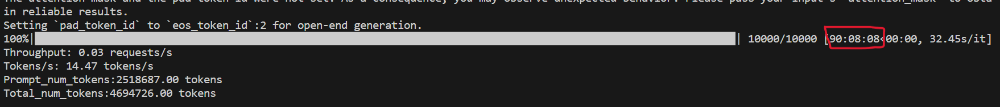

Each log for a specific method is named after the method, and it includes the following information:

1. **Parameters (model_path, tokenizer_path, dtype, tensor_parallel_size):**
   - Model path
   - Tokenizer path
   - Data type (dtype)
   - Tensor parallel size
2. **Decoding Parameters:**
   - Decoding parameters used in the process.
3. **Running Log:**
   - Training logs or logs related to the running of the method.
4. **Output:**
   - Inference output along with output length.

With the exception of the baseline, where due to oversight during testing, the inference output was not saved, and it cannot be retested due to the extended duration of the process. However, a screenshot taken at the end of the run has been retained.

